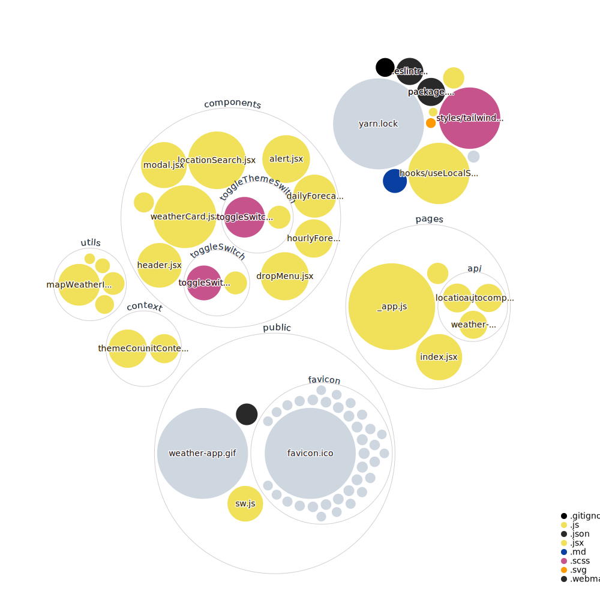

# Weather App

This app uses `Google places API` to get location and `Open Weather Map` to get the weather information of a location.

This App is written in `NextJs` with `TailwindCss`.

- It uses `React Context` to store and pass Theme and Units information to the enitre app.
- It uses `Local Storage` to persist user settings and location on page refresh.

Visualization of the project using the [repo-visualizer](https://github.com/githubocto/repo-visualizer) GitHub Action

